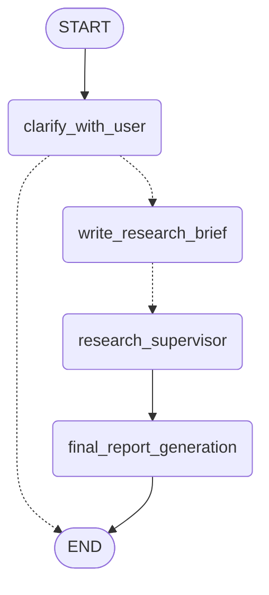
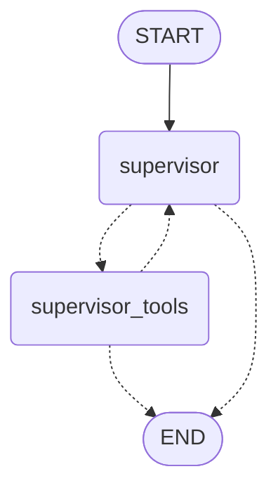
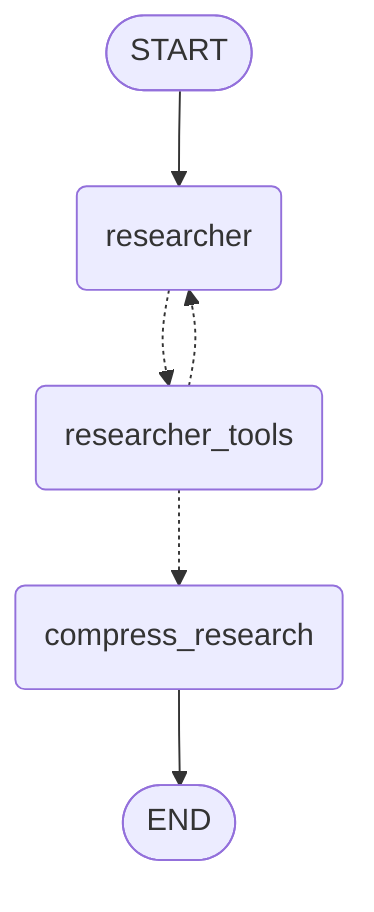

# Deep Understanding of Open Deep Research Architecture

## **1. High-Level Overview**

The system is a **multi-agent LangGraph-based research framework** that takes a user's research question and produces a comprehensive, well-cited research report. It uses a hierarchical architecture with:

- **Main workflow**: Coordinates the entire research process
- **Supervisor agent**: Plans and delegates research tasks
- **Researcher agents**: Execute specific research tasks in parallel
- **Compression layer**: Synthesizes findings
- **Report generation**: Creates the final markdown report

---

## **2. Complete Code Flow (Entry to Exit)**

### **Complete Flow Diagram**

Here's the complete graph structure showing all phases:


<details>
<summary>View Mermaid Source (click to expand)</summary>



</details>

### **Phase 1: User Input → Clarification**
**Entry Point**: `deep_researcher.py:714-716`

```
User Message → clarify_with_user()
```

**Flow**:
1. **`clarify_with_user()`** analyzes user messages
2. Uses `ClarifyWithUser` structured output to determine if clarification is needed
3. **Routes**:
   - If `allow_clarification=true` and needs clarification → Asks user a question and **END**
   - Otherwise → Proceeds to `write_research_brief`

**Key Configuration**:
- `allow_clarification` (`configuration.py:55-64`)
- `research_model` for understanding user intent

---

### **Phase 2: Research Planning**
**Function**: `write_research_brief()`

**Flow**:
1. Takes all user messages and transforms them into a **structured research brief**
2. Uses the `transform_messages_into_research_topic_prompt` (`prompts.py:44-77`)
3. Creates `ResearchQuestion` structured output with detailed research brief
4. Initializes the **supervisor** with:
   - `lead_researcher_prompt` (`prompts.py:79-136`)
   - Research brief as the main task
5. **Routes** → `research_supervisor` (a subgraph)

**Key Files**:
- `state.py:43-48` - `ResearchQuestion` model
- `prompts.py:44-77` - Brief generation prompt

---

### **Phase 3: Research Execution (Supervisor Subgraph)**

The supervisor is its own **StateGraph** (`deep_researcher.py:353-363`) with two nodes:


<details>
<summary>View Mermaid Source (click to expand)</summary>



</details>

#### **3A. Supervisor Node**
**Function**: `supervisor()`

**Flow**:
1. Receives the research brief
2. Has access to three tools:
   - `ConductResearch` - Delegates tasks to researcher agents
   - `ResearchComplete` - Signals research is done
   - `think_tool` - Strategic reflection
3. Uses `lead_researcher_prompt` to decide:
   - Should I break this into parallel sub-tasks?
   - How many researcher agents should I spawn?
   - Can I answer with current findings?
4. Calls tools and proceeds to `supervisor_tools`

**Key Configuration**:
- `max_concurrent_research_units` (`configuration.py:65-77`) - Max parallel researchers
- `max_researcher_iterations` (`configuration.py:96-108`) - Max supervisor iterations

#### **3B. Supervisor Tools Node**
**Function**: `supervisor_tools()`

**Flow**:
1. Processes tool calls from supervisor:
   - **`think_tool`**: Records reflection, continues loop
   - **`ConductResearch`**: Spawns researcher subgraphs **in parallel**
   - **`ResearchComplete`**: Exits to final report generation
2. **Exit conditions**:
   - `research_iterations > max_researcher_iterations`
   - No tool calls made
   - `ResearchComplete` called
3. If `ConductResearch` is called:
   - Limits to `max_concurrent_research_units` parallel tasks
   - Invokes `researcher_subgraph.ainvoke()` for each task
   - Uses `asyncio.gather()` to run in parallel (`deep_researcher.py:305`)
   - Collects compressed research from all researchers
4. **Routes**:
   - Back to `supervisor` to continue research loop
   - To `END` when research is complete

---

### **Phase 4: Individual Research (Researcher Subgraph)**

Each researcher is a separate **StateGraph** (`deep_researcher.py:589-605`) with three nodes:


<details>
<summary>View Mermaid Source (click to expand)</summary>



</details>

#### **4A. Researcher Node**
**Function**: `researcher()`

**Flow**:
1. Receives a **specific research topic** from supervisor
2. Gets available tools from `get_all_tools()`:
   - Search tools (Tavily, ArXiv, OpenAI/Anthropic native search)
   - `think_tool` for strategic reflection
   - `ResearchComplete` to signal done
   - MCP tools if configured
3. Uses `research_system_prompt` (`prompts.py:138-183`)
4. Makes tool calls to gather information
5. Routes to `researcher_tools`

**Key Configuration**:
- `search_api` (`configuration.py:79-95`) - Which search provider
- `research_model` - Model for conducting research
- `max_react_tool_calls` (`configuration.py:109-121`) - Max tool iterations

#### **4B. Researcher Tools Node**
**Function**: `researcher_tools()`

**Flow**:
1. Executes all tool calls in parallel using `asyncio.gather()`
2. Search tools (e.g., Tavily):
   - Calls `tavily_search()` (`utils.py:43-136`)
   - Fetches search results
   - **Summarizes webpage content** using `summarization_model`
   - Returns formatted results with sources
3. **Exit conditions**:
   - `tool_call_iterations >= max_react_tool_calls`
   - `ResearchComplete` called
   - No tool calls made
4. **Routes**:
   - Back to `researcher` to continue searching
   - To `compress_research` when done

#### **4C. Compress Research Node**
**Function**: `compress_research()`

**Flow**:
1. Takes ALL researcher messages (searches, tool outputs, AI responses)
2. Uses `compress_research_system_prompt` (`prompts.py:186-222`)
3. Critical instructions:
   - Preserve ALL information verbatim
   - Add inline citations
   - List all sources
   - Don't lose any details
4. Uses `compression_model` to synthesize findings
5. Returns:
   - `compressed_research`: Clean, cited summary
   - `raw_notes`: Original tool outputs
6. **Exits** the researcher subgraph back to supervisor

**Key Configuration**:
- `compression_model` (`configuration.py:175-184`)
- `compression_model_max_tokens`

---

### **Phase 5: Final Report Generation**
**Function**: `final_report_generation()`

**Flow**:
1. Receives all compressed research findings from supervisor
2. Uses `final_report_generation_prompt` (`prompts.py:228-308`)
3. Instructions include:
   - Structure examples (comparison, list, overview)
   - Markdown formatting rules
   - Citation format with numbered sources
   - Language matching (write in same language as user)
4. Uses `final_report_model` to generate comprehensive report
5. **Retry logic** for token limits:
   - Attempts up to 3 times
   - Progressively truncates findings if token limit exceeded
6. Returns final markdown report
7. **Routes** to `END`

**Key Configuration**:
- `final_report_model` (`configuration.py:195-204`)
- `final_report_model_max_tokens`

---

## **3. State Management**

The system uses different state objects for different parts of the workflow:

### **AgentState** - Main workflow state (`state.py:65-72`)
```python
- messages: User conversation history
- supervisor_messages: Supervisor's conversation
- research_brief: Structured research question
- raw_notes: Unprocessed research data
- notes: Compressed research findings
- final_report: Final markdown output
```

### **SupervisorState** - Supervisor subgraph (`state.py:74-81`)
```python
- supervisor_messages: Supervisor's tool calls & responses
- research_brief: The main research question
- notes: Accumulated research findings
- research_iterations: Loop counter
- raw_notes: Raw research data
```

### **ResearcherState** - Researcher subgraph (`state.py:83-90`)
```python
- researcher_messages: Individual researcher conversation
- tool_call_iterations: Loop counter
- research_topic: Specific research task
- compressed_research: Synthesized findings
- raw_notes: Tool outputs
```

---

## **4. Tool Architecture**

### **Search Tools** (`utils.py:531-580`)

The system supports **5 search APIs**:

1. **Tavily** (`utils.py:43-136`)
   - Executes multiple queries in parallel
   - Deduplicates results by URL
   - **Summarizes webpage content** using AI model
   - Returns formatted results with citations

2. **ArXiv** (`arxiv_tools.py`)
   - `arxiv_search`: Searches academic papers
   - `arxiv_read_paper`: Downloads and extracts full PDF text
   - Perfect for academic research

3. **OpenAI Web Search** (native)
   - Uses OpenAI's built-in web search
   - Detected via `openai_websearch_called()` (`utils.py:652-671`)

4. **Anthropic Web Search** (native)
   - Uses Anthropic's built-in web search
   - Max 5 uses per researcher
   - Detected via `anthropic_websearch_called()` (`utils.py:620-650`)

5. **None** - No search (only MCP tools)

### **Strategic Tools**

**think_tool** (`utils.py:219-244`) - Forces reflection
- Used by both supervisor and researchers
- Creates deliberate pauses for strategic planning
- Helps avoid excessive searching

### **MCP (Model Context Protocol) Tools** (`utils.py:449-524`)

- Allows integration of external tools
- Supports authentication via OAuth token exchange
- Wrapped with error handling
- Configured via `mcp_config` in `configuration.py:216-235`

---

## **5. Key Configuration Points for Customization**

### **Research Behavior** (`configuration.py`)

```python
# Control parallelism
max_concurrent_research_units: 5  # How many researchers run in parallel
max_researcher_iterations: 6       # Max supervisor planning loops
max_react_tool_calls: 10          # Max tool calls per researcher

# Search configuration
search_api: SearchAPI.TAVILY      # Which search provider
max_content_length: 50000         # Max chars before summarization
```

### **Model Selection**

```python
# Different models for different tasks
research_model: "openai:gpt-4.1"           # Planning & research
compression_model: "openai:gpt-4.1"        # Synthesizing findings
final_report_model: "openai:gpt-4.1"       # Writing final report
summarization_model: "openai:gpt-4.1-mini" # Webpage summarization
```

### **Output Structure** (`prompts.py:228-308`)

You can modify:
- Report structure templates
- Citation format
- Section organization
- Language requirements

---

## **6. How to Modify for Your Use Case**

### **Option 1: Change Search Sources**
Edit `configuration.py:79`:
```python
search_api: SearchAPI.ARXIV  # For academic-only research
```

### **Option 2: Custom Report Structure**
Edit `prompts.py:256-278` to add your own structure:
```python
To answer a question about [YOUR DOMAIN], structure it like:
1/ Executive Summary
2/ Technical Analysis
3/ Recommendations
```

### **Option 3: Add Domain-Specific Tools**
1. Create a new tool in `utils.py` or separate file
2. Add it to `get_all_tools()` (`utils.py:582-610`)
3. Update the researcher prompt to explain when to use it

### **Option 4: Modify Research Strategy**
Edit `prompts.py:79-136` to change how the supervisor delegates:
```python
# Add your own delegation rules
<Scaling Rules>
For [YOUR USE CASE], use X sub-agents and focus on Y
</Scaling Rules>
```

### **Option 5: Change Output Format**
Modify `prompts.py:298-307` for different citation styles:
```python
# Change from numbered citations to footnotes, APA, etc.
```

---

## **7. Advanced Customization Points**

1. **Token Limit Handling** (`utils.py:678-798`)
   - Auto-detects token limit errors
   - Add your model to `MODEL_TOKEN_LIMITS` (`utils.py:801-842`)

2. **Webpage Summarization** (`utils.py:175-213`)
   - Modify `summarize_webpage_prompt` (`prompts.py:311-367`)
   - Change summary length, focus areas

3. **State Reducers** (`state.py:55-60`)
   - `override_reducer` allows overriding state values
   - Useful for clearing accumulated data

---

## **8. Complete Flow Diagram**

```
User Input
    ↓
[clarify_with_user] → Ask question? → END (wait for user)
    ↓ No clarification needed
[write_research_brief] → Create structured research brief
    ↓
[research_supervisor SUBGRAPH START]
    ↓
[supervisor] → Plan research strategy
    ↓ Call ConductResearch tools
[supervisor_tools] → Spawn parallel researchers
    ↓ For each research task...
    ├─→ [researcher SUBGRAPH 1]
    │       ↓
    │   [researcher] → Search for info
    │       ↓
    │   [researcher_tools] → Execute searches
    │       ↓
    │   [compress_research] → Synthesize findings
    │       ↓ Return compressed research
    ├─→ [researcher SUBGRAPH 2] (parallel)
    ├─→ [researcher SUBGRAPH 3] (parallel)
    │   ...
    ↓ Collect all findings
[supervisor_tools] → Aggregate results
    ↓ Enough info?
[supervisor] → Reflect with think_tool
    ↓ ResearchComplete called?
[supervisor_tools] → Exit supervisor
    ↓
[research_supervisor SUBGRAPH END]
    ↓
[final_report_generation] → Write comprehensive report
    ↓
END → Return markdown report
```

---

## **9. File Reference Guide**

### **Core Files (in `open_deep_research/src/open_deep_research/`)**

- **`deep_researcher.py`** - Main LangGraph workflow with all nodes and subgraphs
- **`configuration.py`** - All configurable parameters and settings
- **`prompts.py`** - System prompts for each phase of research
- **`state.py`** - State definitions for agents and subgraphs
- **`utils.py`** - Helper functions, tools, and utilities
- **`arxiv_tools.py`** - Academic paper search and retrieval tools

### **Key Entry Points**

1. Main graph compilation: `deep_researcher.py:719` (`deep_researcher = deep_researcher_builder.compile()`)
2. Configuration loading: `configuration.py:238-249` (`Configuration.from_runnable_config()`)
3. Tool initialization: `utils.py:582-610` (`get_all_tools()`)

---

## **10. Execution Flow Summary**

This architecture is highly modular and customizable. The key insight is the **hierarchical agent structure**:

1. A **supervisor** that plans and delegates
2. **Parallel researchers**, each with their own tool-calling loop
3. **Compression layer** that synthesizes findings
4. **Final synthesis** that creates a comprehensive report

All components communicate through well-defined state objects, making the system easy to extend and customize for specific research domains.
